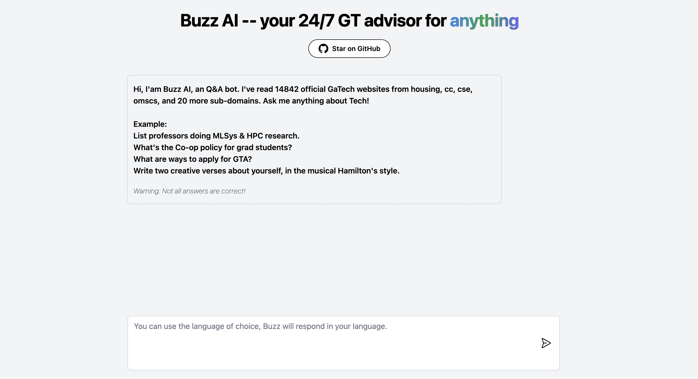

# Buzz AI


BuzzAI or gt-chat is a question-answering chatbot that is designed to answer any questions about __GaTech__. The chatbot is powered by Next.js, FastAPI, and OpenAI, and it provides a fast and intuitive interface for finding answers to commonly asked questions by sourcing from over [14k Georgia Tech websites](./back/websites.txt). You can try it out at [gt-chat.org](https://gt-chat.org)!



## Getting Started

To use BuzzAI, you can simply go to the [gt-chat.org](https://gt-chat.org) or clone the repository and run the chatbot locally.

To run the chatbot locally, you will need to clone the repository and follow the instructions below.

## Frontend Installation
To start the frontend you will need:

- Node.js 12 or later installed
- The URL of the backend server as an environment variable `DOMAIN`

__Deployment__

[](https://vercel.com/new/clone?repository-url=https%3A%2F%2Fgithub.com%2Fhxu296%2Fgt-chat)

__Installing__

Clone the repository and then run the following command to install the required dependencies:

```bash
npm install
```

__Running the Chatbot__

To start the chatbot, run the following command:

```bash
npm run dev
```

This will start the Next.js development server and open the chatbot in your default browser at http://localhost:3000.


## Backend Installation

The backend for the project is a python fastapi server that uses the LangChain + OpenAI API to generate answer for to `/qa` GET endpoint.

__Supabase__

You will need to set up a Supabase project and create a table called `qa_log` with the following schema:

| Column Name | Data Type |
| ----------- | --------- |
| id          | uuid      |
| created_at  | timestamp |
| question    | text      |
| answer      | text      |
| success     | boolean   |

You need the Supabase project URL and service key to set up the environment variables later.

__Deployment__

Change the Railway build command to `bash build.sh` and it should work out of the box.

[](https://railway.app/template/FZffm_?referralCode=wOsORh)

__To run the server locally:__

Step 1: Set up python environment and fetch OpenAI embeddings
```
python3 -m venv venv
bash build.sh
```

Step 2: Set up environment variables
```
export OPENAI_API_KEY=<your key>
export SUPABASE_URL=<supabase project url>
export SUPABASE_KEY=<supabase project *service* key, not annon key>
```

Step 3: Run Local Server
```
python main.py
```

## Contributing

Pull requests are always welcomed!